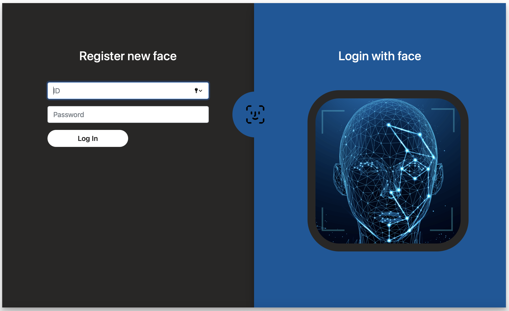
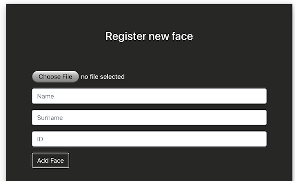
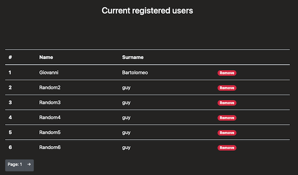
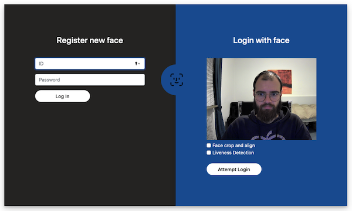
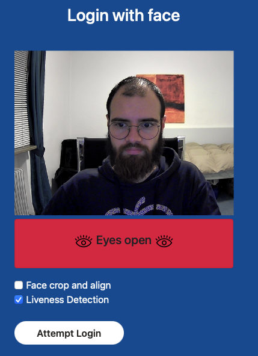
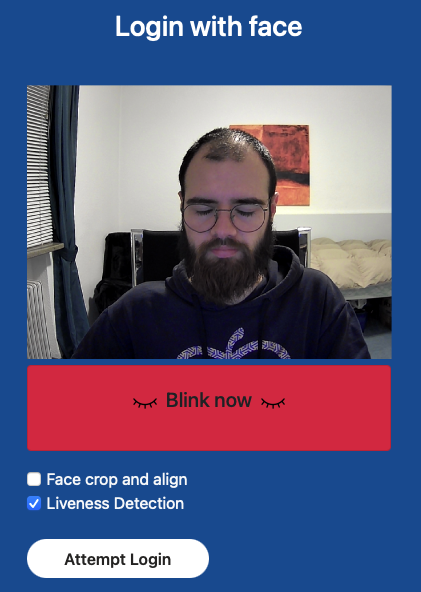

# face-detection-UI
web UI for [who's that pokemon](https://github.com/giobart/whos_that_pokemon/tree/develop) project

**Disclaimer 1**: This webapp has the only purpose of showing the potential of the models explored inside the Research block of the project. This is not intended to be a real world application. 

**Disclaimer 2**: Don't trust the username & pass login, it is just a demonstrative login with default username "admin" and password "admin". Nothing more than a graphical feature to simulate a system administrator that adds new people to the database.

# How does it work


- A system administrator can login using Id and Password in order to manage the registered users or register a new user
    - To register a new user a picture of his face must be selected
    
    - Scrolling down in the administrator panel is possible to manage the current registerd users
    
    - Disclaimer: Don't trust the username & pass login, it is just a demonstrative login with default username "admin" and password "admin". Nothing more than a graphical feature to simulate a system administrator that adds new people to the database.
- The face login can be activated clicking on the face icon on the right
    - The webcam will be activated
    
    - If face crop and align option is ticked then the login probability is higher. The face will be cropped using the image transformation described in the research block of the project. 
    - If the liveness detection option is ticked then during the login the user must follow the steps shown below
    
    
    - If the login fails then the reason will be showed 
    - Otherwise the name of the recognized person will be shown <br>
    


# Environment setup
Install the requirements with
```
pip install -r requirements
```

If you're not using the default url or port for the 'image-registration-service' please update the environment variable accordignly with:
```
export K8_IMAGE_REGISTRATION_SERVICE='http://<new url to the image registration service>:<port>'
```
# Run the service locally
- run the UI with `python entry.py`. This will start the web server at localhost:5006. <br>
- In order to upload a new image to the database or use the login you must also run the `ìmage-registration-service` on the default 5005 port.  <br>
- If you plan to use the liveness detection the you have to run also the `liveness-detection-service` on the default 5007 port. <br>

# Deploy on Openshift
In order to deploy this service on Openshift the following config files must be updated

- The build configuration YAML file must be updated accordingly
    ```
    strategy:
        type: Source
        sourceStrategy:
          from:
            kind: ImageStreamTag
            namespace: openshift
            name: 'python:3.6'
          env:
            - name: K8_IMAGE_REGISTRATION_SERVICE
              value: 'http://<cluster address of the image registration service>:8080'
    ```
- Inside the service configuration YAML file update the route target port for the 8080-tcp spec
    ```
    spec:
      ports:
        - name: 8080-tcp
          protocol: TCP
          port: 8080
          targetPort: 5005
    ```
- Since this service must be exposed, be sure to setup the route. 
- Force encryption over TLS for the route updating the route configuration YAML file accordingly
    ```
    annotations:
        app.openshift.io/connects-to: image-registration-service
        openshift.io/host.generated: 'true'
        haproxy.router.openshift.io/hsts_header: max-age=31536000;includeSubDomains;preload
    
    spec:
      tls:
        termination: edge
    ```